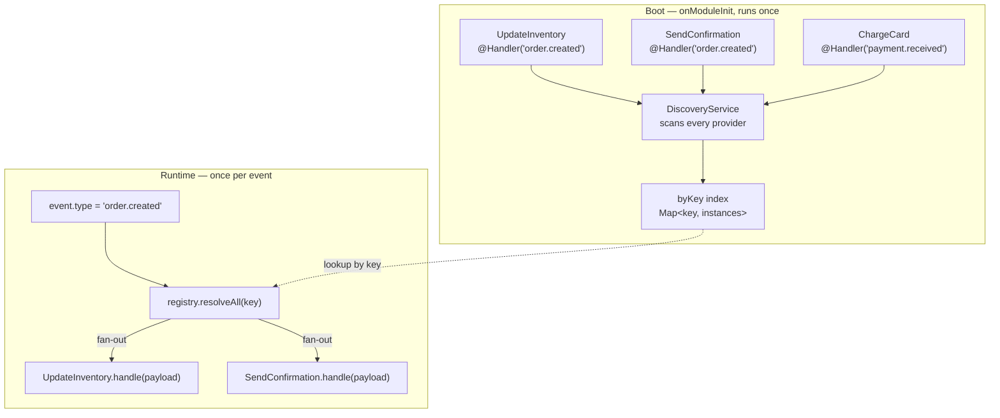
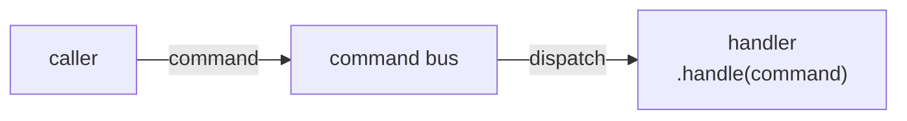
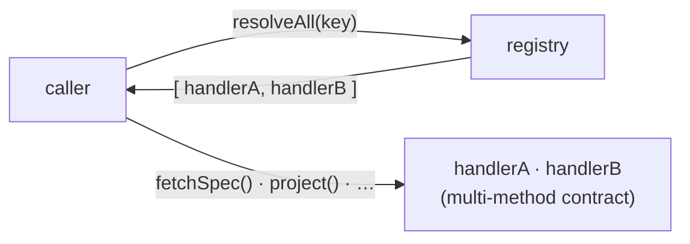

## Why this exists

Some backend work cannot be wired to a single, statically-known collaborator. A worker that consumes integration events does not know at compile time which piece of code should react to `order.created` versus `payment.received` — and it should not have to. New reactions get added over time, sometimes by a different bounded context, and the dispatcher should stay untouched when they do.

The naive fix is a `switch` on the key, or a module that imports every possible handler and injects them by hand. Both fuse the dispatcher to the full set of handlers: every new handler edits the dispatcher, and the dispatcher ends up importing across bounded-context boundaries it has no business knowing about.

The handler registry is the alternative. A provider declares the keys it handles with a `@Handler(...)` decorator; the framework discovers every decorated provider once at boot and indexes them by key; and a dispatcher asks `resolveAll(key)` for the handlers registered under a key — without importing any of them, and without changing when a new one is added.

The module lives at `backend/src/@aurora/modules/handler-registry/` and is imported through your code as `@aurora/modules/handler-registry`.

## The three pieces

### 1. `@Handler(...keys)` — the marker

A class decorator that records, in reflection metadata, the keys a provider answers to. It supports both variadic and stacked forms:

```ts
@Handler('order.created', 'order.updated')   // variadic — both keys in one call
@Injectable()
export class OrderProjector { /* … */ }

@Handler('payment.received')                  // stacked — two separate calls
@Handler('payment.refunded')                  // on the same class
@Injectable()
export class PaymentProjector { /* … */ }
```

The decorator **accumulates** keys rather than overwriting them. Each call reads the metadata already on the target and merges its new keys in:

```ts
export function Handler(...keys: string[]): ClassDecorator {
  return (target: object): void => {
    const existing: string[] = Reflect.getMetadata(HANDLER_KEYS, target) ?? [];
    Reflect.defineMetadata(HANDLER_KEYS, [...existing, ...keys], target);
  };
}
```

This matters for the stacked form. A naive `Reflect.defineMetadata(HANDLER_KEYS, keys, target)` would overwrite on every call, so two stacked `@Handler` decorators would silently drop all but the last-applied one. Accumulating on read keeps every key discoverable.

### 2. `KeyedHandlerRegistry` — the index

An `@Injectable()` service that implements `OnModuleInit`. At boot it walks every provider NestJS knows about, reads its `@Handler` keys, and files the provider's **instance** under each key in a `Map<string, T[]>`:

```ts
@Injectable()
export class KeyedHandlerRegistry<T = unknown> implements OnModuleInit {
  private readonly byKey = new Map<string, T[]>();

  constructor(private readonly discovery: DiscoveryService) {}

  onModuleInit(): void {
    for (const wrapper of this.discovery.getProviders()) {
      if (!wrapper.metatype) continue;
      const keys: string[] | undefined = Reflect.getMetadata(HANDLER_KEYS, wrapper.metatype);
      if (!keys?.length) continue;
      for (const key of keys) {
        const existing = this.byKey.get(key) ?? [];
        existing.push(wrapper.instance as T);
        this.byKey.set(key, existing);
      }
    }
  }

  resolveAll(key: string): T[] {
    return this.byKey.get(key) ?? [];
  }
}
```

Two properties fall out of this design:

- **Discovery happens once, at boot.** The `onModuleInit` lifecycle hook runs the scan exactly one time. Runtime `resolveAll` calls are a plain map lookup — no reflection, no re-scanning.
- **The registry is domain-agnostic.** It stores raw instances of `T` (defaulting to `unknown`) and hands them back untouched. It never knows what methods a handler exposes; the caller does. That is what lets the module import nothing from any bounded context or from `@app` — it depends only on `@nestjs/common` and `@nestjs/core`.

`resolveAll` **never throws**. An unknown key returns an empty array, so a dispatcher can fan out over zero handlers without a guard.

### 3. `HandlerRegistryModule` — the wiring

A framework module decorated `@Global()`. It imports `DiscoveryModule` (which provides the `DiscoveryService` the registry needs), and provides and exports `KeyedHandlerRegistry`:

```ts
@Global()
@Module({
  imports: [DiscoveryModule],
  providers: [KeyedHandlerRegistry],
  exports: [KeyedHandlerRegistry],
})
export class HandlerRegistryModule {}
```

Because it is `@Global()`, any module — in any bounded context — can inject `KeyedHandlerRegistry` without importing this module explicitly. It is imported once near the application root and is then available everywhere.

## How a dispatch flows

Put together, a single dispatch looks like this:

1. **At boot**, `KeyedHandlerRegistry.onModuleInit` scans all providers and builds the `byKey` index. Every `@Handler`-decorated provider that NestJS instantiated is now reachable by its keys.
2. **At runtime**, a dispatcher injects the registry and calls `resolveAll(someRuntimeKey)`.
3. The registry returns the array of handler instances filed under that key — the DI-managed singletons, in registration order.
4. The dispatcher iterates and invokes whatever method the shared handler interface defines.

The two phases — index once at boot, look up per event — look like this:



That last step needs a method to call — and `handle` does **not** come from the registry. The registry returns raw instances and knows nothing about their methods. `handle` comes from a contract *you* define and every handler implements; you hand that contract to the registry as its generic type parameter so the returned instances are typed:

```ts
// 1. The contract the dispatcher depends on and every handler implements.
export interface OrderHandler {
  handle(payload: unknown): Promise<void>;
}

// 2. A handler implements it — this is where the `handle` method physically lives.
@Handler('order.created')
@Injectable()
export class UpdateInventory implements OrderHandler {
  async handle(payload: unknown): Promise<void> { /* … */ }
}

// 3. The dispatcher types the registry with that contract, so resolveAll returns OrderHandler[].
@Injectable()
export class OrderDispatcher {
  constructor(private readonly registry: KeyedHandlerRegistry<OrderHandler>) {}

  async dispatch(event: { type: string; payload: unknown }): Promise<void> {
    for (const handler of this.registry.resolveAll(event.type)) {
      await handler.handle(event.payload); // .handle() comes from OrderHandler, not from the registry
    }
  }
}
```

The generic `<OrderHandler>` is the bridge between the typeless registry and your contract: it makes `resolveAll` return `OrderHandler[]` instead of `unknown[]`, so TypeScript knows each element has `.handle()`. It is a *typing* bridge, not a runtime guarantee — see [the trade-off below](#trade-offs-and-limits): if you file a provider that does not implement `OrderHandler` under the same key, the cast lies and `.handle()` fails at runtime. The rule that follows is that every handler under a given key implements the same interface.

The dispatcher imports `OrderHandler` (the interface it expects) and nothing else. It never imports a concrete projector, so adding a new projector for `order.created` is a matter of writing one `@Handler('order.created')`-decorated provider — the dispatcher does not change.

## Fan-out: many handlers, one key

The index is a `Map<string, T[]>`, not `Map<string, T>`. Several providers can declare the same key, and `resolveAll` returns all of them:

```ts
@Handler('order.created') @Injectable() class UpdateInventory {}
@Handler('order.created') @Injectable() class SendConfirmation {}
@Handler('order.created') @Injectable() class NotifyWarehouse {}

registry.resolveAll('order.created'); // → [UpdateInventory, SendConfirmation, NotifyWarehouse]
```

This is the registry's reason for existing over a plain `Map` lookup: a key fans out to every handler that subscribed to it, and the dispatcher loops over the result without knowing how many there are.

The same instance can also appear under several keys — a provider with `@Handler('a', 'b')` is filed under both, and `resolveAll('a')` and `resolveAll('b')` return the same DI-managed singleton.

## The EventDispatcher: the shipped single-method path

The resolve-and-loop in `OrderDispatcher` above is so common that the module ships it generically — for the single-method fan-out case you inject it instead of writing the loop:

```ts
export interface Dispatchable<P = unknown> {
  handle(payload: P): Promise<void>;
}

@Injectable()
export class EventDispatcher {
  constructor(private readonly registry: KeyedHandlerRegistry<Dispatchable>) {}

  async dispatch<P>(key: string, payload: P): Promise<void> {
    for (const handler of this.registry.resolveAll(key) as Dispatchable<P>[]) {
      await handler.handle(payload); // sequential, fail-fast
    }
  }
}
```

Consumers inject it and dispatch by a runtime key. Define that key once as a shared constant — referenced by the `@Handler` side and the `dispatch` side alike — never a bare string literal:

```ts
// order-events.keys.ts — the single source of truth for the key.
export const ORDER_CREATED = 'order.created';

// Handler side:
@Handler(ORDER_CREATED)
@Injectable()
export class UpdateInventory implements Dispatchable { /* … */ }

// Dispatch side:
constructor(private readonly dispatcher: EventDispatcher) {}
// …
await this.dispatcher.dispatch(ORDER_CREATED, payload);
```

The key is an unchecked plain string at runtime: a typo on either side resolves silently to `[]` rather than erroring (see [Trade-offs and limits](#trade-offs-and-limits)). A shared constant guarantees both sides reference the same value.

It is a **free add-on over the registry**, not a new mechanism: the same `resolveAll`, the same pull model, the single-method loop written once. It is opinionated on purpose:

- **Returns `void`.** No result collection — returning results would tempt callers to couple to the count or order of an open fan-out set, the very thing fan-out hides. (If you need a result back, you are not fanning out; that is a single-handler query — resolve it and call it directly.)
- **Sequential, fail-fast.** Handlers run in registration order; the first rejection propagates and the rest do not run. Not `Promise.all`, which would blur error attribution.
- **Unknown key is a safe no-op** — `resolveAll` returns `[]`, so the loop runs zero times.

A handler opts in by implementing `Dispatchable<P>` and carrying `@Handler(key)`. Anything whose contract is richer than a single `handle` does not belong here — that is the multi-method case below.

## Beyond fan-out: coordinating handlers that share work

Fan-out above assumes the handlers are **independent**: each one reacts to the key on its own, through a single `handle` method, and none of them needs anything from the others. That is the common case, and a one-method contract is all it needs.

A second shape exists, and it is worth naming because it looks like fan-out but is not. Sometimes the handlers under a key are not independent reactions but **coordinated stages of one process that share data**. The canonical example in this codebase is the SAP sync worker: every projector for an event type knows both (a) what to fetch from the upstream system and (b) how to project the fetched payload into its replica. Those are two halves of one responsibility, so the contract has more than one method:

```ts
export interface SapEventProjector {
  readonly handles: string[];
  fetchSpec(event: SapEvent): SapFetchSpec;               // what to fetch
  project(raw: unknown, event: SapEvent): Promise<void>;  // how to apply it
  remove(key: string, event: SapEvent): Promise<void>;    // how to delete it
}
```

The enabler is the same `resolveAll` you already saw — and it is worth being explicit about *why* it enables this. A command bus **pushes** the work away from you: you hand it a command and it travels to the handler (`command → handler`); once you let go, the bus invokes one method and you are out of the loop. The registry is the inverse — it **pulls**: you ask it for the handlers and they come back to you (`handler(s) ← registry`). You hold the instances, so you keep control after resolving and can invoke whatever methods the contract defines, in whatever order, coordinating across them.

**CQRS command bus — push** (`command → handler`):



You hand the command off and step out of the loop. The bus owns the call and invokes exactly one method; nothing coordinates one handler with another.

**Handler registry — pull** (`handler(s) ← registry`):



The handlers come back to you. You hold the instances and stay in control: call whatever methods the contract defines, in any order, and coordinate across them (merge specs → one fetch → fan out).

| Aspect | CQRS command bus — push | Handler registry — pull |
| --- | --- | --- |
| Direction | `command → handler`; the message travels in | `handler(s) ← registry`; the handlers come back |
| Who invokes the method | the bus | you, the caller |
| Methods called | one, fixed (`handle`) | any the contract defines, in your order |
| Control after dispatch | caller is out of the loop | caller stays in control |
| Coordinate across handlers | no — each runs independently | yes — merge, sequence, or share data |
| Fits | fire-and-forget independent reactions | stages that share work (e.g. a coalesced fetch) |

Concretely, that pull is what lets an orchestrator merge work across the handlers before acting:

```ts
const projectors = registry.resolveAll(event.type);
// collect each projector's fetch spec, merge them into ONE, fetch once…
const raw = await sap.fetch(mergeSpecs(projectors.map((p) => p.fetchSpec(event))));
// …then fan the single result back to each projector.
for (const p of projectors) await p.project(raw, event);
```

This is the only reason to reach for a multi-method contract instead of plain fan-out: **to coalesce work across the handlers**. Several projectors handle the same entity, so instead of each one fetching it separately, the orchestrator merges their fetch specs and issues a single upstream call, then distributes the one response. It is an optimization for the many-handlers-over-one-resource case — fewer round-trips to a rate-limited upstream.

Be honest about when it earns its keep:

- **With a single handler per key it buys nothing.** `mergeSpecs([oneSpec])` is that spec, one fetch, one project — identical to fan-out with extra ceremony. The shape only starts paying off when two or more handlers genuinely share the same resource under the same key.
- **The orchestrator is no longer a dumb bus.** It carries the coordination logic — merge, single fetch, distribute. That logic is inherently cross-handler: it cannot live inside any one handler, so it has to sit above them. If you do not need cross-handler coordination, do not pay for it — keep the single-method `handle` contract.
- **Coalescing often belongs in the fetch layer instead.** A loader that dedupes calls by resource key (the DataLoader pattern) gives you the same fewer-round-trips win while keeping every handler an autonomous, single-method reaction. Reach for multi-method orchestration only when coordination must happen at the dispatch level — for example, merging *different field selections* of the same entity into one request, which a key-only loader does not do on its own.

In short: fan-out with a one-method contract is the default. The multi-method, orchestrated shape is a deliberate optimization for handlers that share a resource — not a richer or more correct way to use the registry, just the right tool when coalescing across handlers actually pays off.

## Choosing the tool: event emitter, EventDispatcher, or the registry

Three shapes, three tools — and most "react to something" needs are the first one.

**1. An independent reaction, no orchestration → the event emitter.** Something happened and whoever cares reacts, decoupled. This is a **push**: the publisher emits and NestJS's `EventEmitter2` routes to every `@OnEvent` listener; the publisher neither holds the listeners nor waits on them. No registry, no dispatcher — the idiomatic and most common path. Aurora handlers already publish domain events this way with `@EmitEvent`. Reach for it whenever you do not need to await the reactions or control their outcome.

**2. Single-method fan-out you must drive and await → `EventDispatcher`.** The same independent-reaction shape, but the dispatch point must **pull**: resolve the handlers by a runtime key, await them all, and fail if one throws. The canonical case is a queue worker or controller that pulls a job, looks up handlers by a key that is *data* (not a compile-time event name), runs them, and must reject the job on failure. Fire-and-forget cannot give you that completion-and-failure control; the registry's pull model can, and `EventDispatcher` is the ready-made loop.

**3. Multi-method coordination → the `KeyedHandlerRegistry` directly.** Handlers are coordinated stages that share data — collect, merge, one I/O, distribute. Inject the registry typed to your port and orchestrate, as in [Beyond fan-out](#beyond-fan-out-coordinating-handlers-that-share-work).

| You need… | Reach for | Model |
| --- | --- | --- |
| A decoupled reaction, with no need to await or control it | event emitter (`@EmitEvent` / `@OnEvent`) | push |
| Single-method fan-out where the caller awaits and fails fast, keyed at runtime | `EventDispatcher` | pull |
| Coordinated multi-method stages sharing a resource | `KeyedHandlerRegistry` (direct) | pull |

Rule of thumb: if you do not need to **hold** the handlers — to await them, control their order, fail fast, or call more than one method — you probably do not need the registry at all. Emit an event.

## Trade-offs and limits

- **Discovery is boot-time only.** A provider added to the DI graph after bootstrap is not indexed. In practice every NestJS provider is known at boot, so this is rarely a constraint — but dynamically-created instances outside the module graph will not appear.
- **Keys are plain strings, unchecked at compile time.** A typo in a key — on either the `@Handler` side or the `resolveAll` side — does not error; it silently resolves to `[]`. Centralize keys in shared constants so both sides reference the same symbol-like value.
- **The generic `T` is a convenience, not a guarantee.** `KeyedHandlerRegistry<OrderHandler>` makes `resolveAll` *return* `OrderHandler[]`, but nothing verifies that the discovered instances actually implement `OrderHandler` — discovery matches on the metadata key, not on the interface. Keep the handler contract in a shared interface and have every handler `implements` it, so the cast is honest.
- **Providers without a class metatype are skipped.** The scan reads `Reflect.getMetadata(..., wrapper.metatype)`, so `useValue` / `useFactory` providers that have no class metatype are never indexed even if you attach metadata to the value. Handlers must be class providers.

## When to use it

- Dynamic dispatch by a **runtime** key — an event type, message type, or command name — where the dispatcher should not know the concrete handlers.
- **Fan-out**: a single key should reach an open-ended set of handlers, and new handlers get added over time without touching the dispatcher.
- The handlers live in **different modules or bounded contexts** from the dispatcher, and importing them directly would couple boundaries that should stay independent.

## When NOT to use it

- **The collaborator is known at compile time.** Inject it directly. The registry's indirection buys nothing.
- **A static, single-token set is enough.** If you just need "all providers bound to one token" and the binding is fixed, NestJS multi-provider injection (`@Inject(TOKEN)` resolving to an array) is simpler. The registry earns its keep when dispatch is keyed by an arbitrary runtime string and buckets handlers per key.

## Related

- [Register and resolve handlers](../../../guides/backend/register-and-resolve-handlers/) — step-by-step recipe to decorate a handler, dispatch by key, and verify discovery in a test.
- [Cross-bounded-context ports](../cross-bounded-context-ports/) — the complementary pattern for *static* cross-BC dependencies; the registry handles the *dynamic, keyed* ones.
- [Backend module scaffolding](../module-scaffolding/) — how a single bounded context is laid out internally.
