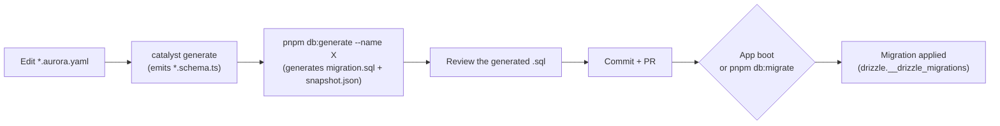

## Goal

Walk through the complete cycle for taking a schema change from the Aurora YAML to a real database, and know what to do when the CI check (`schema-drift-check`) fails on your PR.

## Before you start

- An Aurora Catalyst backend with drizzle-kit already configured (`backend/drizzle.config.ts`).
- You know the YAML → CLI → generated code flow (see [Module scaffolding](../../../concepts/backend/module-scaffolding/)).
- Write access to the development database if you're going to apply migrations locally.

## How the schema materializes

In Aurora Catalyst the database schema changes **exclusively** through versioned migrations. DDL is never inferred or applied "live" by comparing code against the database: every schema change goes through two artifacts checked into git, reviewed in the PR like any other code:

- A `migration.sql` with the exact DDL that will run — readable, reviewable in a PR, just like any other code change.
- A `snapshot.json` describing the schema's state after that migration is applied — the baseline the next change is diffed against.

If you know Laravel, the parallel is direct: `php artisan make:migration` + `php artisan migrate` is exactly this same pattern — an explicit artifact plus a separate apply command. The difference with drizzle-kit is that the equivalent of `make:migration` is auto-generated by diffing: you don't write the DDL by hand, `drizzle-kit generate` computes it by comparing your `*.schema.ts` files against the last snapshot.

## The complete cycle



1. **You edit `*.aurora.yaml`** — the new field or table is declared there, never directly in TypeScript.
2. **`catalyst generate`** reads the YAML and emits (among other files) the drizzle `*.schema.ts` under `infrastructure/drizzle/`. This step does NOT touch the database and does not generate any migration — it only updates the table's TypeScript definition.
3. **`pnpm db:generate --name <descriptive-name>`** — this is where drizzle-kit comes in: it diffs the freshly-updated `*.schema.ts` against the last `snapshot.json` and writes a new folder with `migration.sql` + `snapshot.json`. This is an **offline** step: no database connection is opened.
4. **You review the generated `.sql`** before signing off on the change — confirm it describes only what you expect (the intended `CREATE`s/`ALTER`s, no accidental `DROP`).
5. **Commit** the complete migration folder (`migration.sql` + `snapshot.json`) together with the `*.schema.ts` that produced it.
6. **Applying it**: in development, the next app boot applies it automatically (`DrizzleMigrationsRunner` on boot). For deploys you can use `pnpm db:migrate` as an explicit step, without starting the application.

## The three `db:*` scripts

| Script | What it does | Example | Expected output |
| --- | --- | --- | --- |
| `pnpm db:generate --name <name>` | Generates a new migration from the `*.schema.ts` diff. The name is mandatory — without it, the command fails explicitly instead of inventing a random nickname. | `pnpm db:generate --name add-invoice-tables` | Creates `src/database/migrations/drizzle/<timestamp>_add-invoice-tables/` with `migration.sql` and `snapshot.json`. |
| `pnpm db:migrate` | Applies pending migrations without starting Nest, reusing the exact same mechanism the boot uses. | `pnpm db:migrate` | `Applying drizzle schema migrations...` followed by `Drizzle schema migrations up to date.` If there's nothing pending, it finishes just as fast (a no-op). |
| `pnpm db:check` | Detects drift without touching the database: runs a probe `generate` and checks whether it produces a new folder. This is the command CI runs. | `pnpm db:check` | `Sin drift: *.schema.ts está alineado con el snapshot.` (exit 0), or a drift message plus instructions (non-zero exit). |

### When `schema-drift-check` fails on your PR

The `.github/workflows/schema-drift-check.yml` CI workflow runs `pnpm db:check` on every PR that touches a `*.schema.ts` file or the migrations folder. If it fails, it means you edited the schema without generating its corresponding migration. The fix is always the same: run `pnpm db:generate --name <descriptive>` locally, review the resulting `.sql`, and add the generated folder to the same commit/PR.

## `DATABASE_MIGRATE_ON_BOOT`: who applies the migration, and when

By default (variable absent, or `true`) every application boot applies pending migrations automatically. That's the right behavior for development: nobody has to remember an extra step.

In **multi-replica production**, this same mechanism is a risk: migrations apply inside a single transaction, but WITHOUT a lock (an *advisory lock*). If two replicas boot at the same time, both can attempt to apply the same migration — whichever loses the race fails its boot (nothing gets corrupted, but it's an avoidable deploy failure).

The supported pattern for that case: set `DATABASE_MIGRATE_ON_BOOT=false` and apply the schema as an explicit deploy step, before replicas come up:

```bash
DATABASE_MIGRATE_ON_BOOT=false pnpm db:migrate
```

### Hosting with a restricted database user

If your hosting (say, a Plesk-style panel) gives you a database user without the `CREATE` privilege, you'll run into this: `migrate()` unconditionally runs `CREATE SCHEMA IF NOT EXISTS`, and Postgres denies that statement for a user without `CREATE` **even if the schema already exists**. No variable avoids that call. The pattern is the same as multi-replica: `DATABASE_MIGRATE_ON_BOOT=false` + `pnpm db:migrate` run with privileged credentials at deploy time, leaving the runtime application on the restricted user.

## `DATABASE_MIGRATIONS_SCHEMA` / `DATABASE_MIGRATIONS_TABLE`

Optional, with the same defaults as drizzle-orm (`drizzle` / `__drizzle_migrations`). They let you move the "ledger" of applied migrations to a different schema or table name — for example, if your hosting reserves the `drizzle` schema for something else.

**Important gotcha:** don't change these variables on an environment that already has migrations applied. The new journal appears empty, and `migrate()` would interpret that no migration has ever been applied — it would re-run every single one from scratch. Decide the location once, before that environment's first boot, and don't touch it afterward.

## Common problems

**I hand-edited a `migration.sql` and now `generate` asks weird decisions (hints) for the whole team.** The `snapshot.json` accompanying that migration got out of sync with the actual SQL. The fix is to regenerate that migration while keeping its folder name EXACTLY the same — drizzle decides what to apply by name, not by content, so renaming is safe. Never hand-edit `snapshot.json`: it's hundreds of KB of generated JSON.

**I'm working in a worktree and tables from another branch suddenly show up in my database.** This project's worktrees share the same development database. If `DATABASE_MIGRATE_ON_BOOT` is at its default, every boot applies whatever migration is present on that worktree's disk — including one from an unmerged branch. That's not a bug in the mechanism, it's a consequence of the shared environment.

**My migration fails on an index-name clash that has nothing to do with my table.** Postgres shares the index namespace per *schema*, not per table. Two migrations that generate an index with the same short name (`row_id_key`, for example) collide even if they belong to unrelated tables. Always qualify the index name with the table (`<table>_<columns>_idx`) and stay under 63 characters (Postgres's identifier limit).

**I installed or regenerated a module with the CLI and nothing changed in the database.** That's expected: the CLI distributes *definitions* (`*.schema.ts`), never migrations. After generating or regenerating a module that touches `infrastructure/drizzle/*.schema.ts`, you still owe the repo a `pnpm db:generate --name <something>` yourself.

## Related

- [Module scaffolding](../../../concepts/backend/module-scaffolding/) — where the `*.schema.ts` that drizzle-kit diffs comes from.
- Full operational reference (resync procedure, baseline stamp on pre-existing databases): `backend/src/database/migrations/drizzle/README.md` in the `aurora-catalyst` repository.
