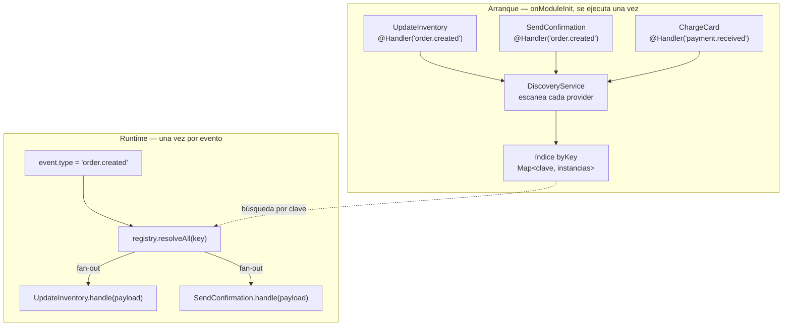
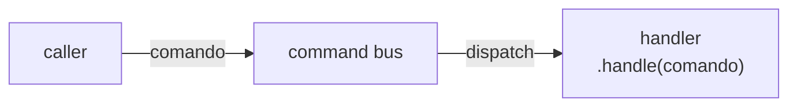
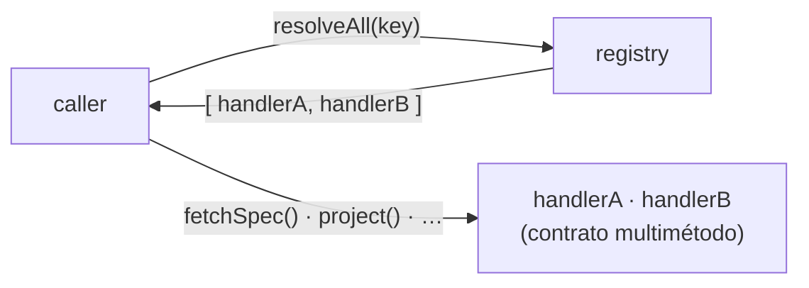

## Por qué existe

Cierto trabajo del backend no se puede cablear a un único colaborador conocido de antemano. Un worker que consume eventos de integración no sabe, en tiempo de compilación, qué pieza de código debe reaccionar a `order.created` frente a `payment.received` — y no debería tener que saberlo. Con el tiempo se añaden nuevas reacciones, a veces desde otro bounded context, y el dispatcher debería quedar intacto cuando eso ocurre.

El arreglo ingenuo es un `switch` sobre la clave, o un módulo que importa todos los handlers posibles y los inyecta a mano. Ambos funden el dispatcher con el conjunto completo de handlers: cada handler nuevo edita el dispatcher, y este acaba importando a través de fronteras de bounded context que no tiene por qué conocer.

El registro de handlers es la alternativa. Un provider declara las claves que atiende con un decorador `@Handler(...)`; el framework descubre cada provider decorado una sola vez en el arranque y los indexa por clave; y un dispatcher pide `resolveAll(key)` los handlers registrados bajo una clave — sin importar ninguno de ellos, y sin cambiar cuando se añade uno nuevo.

El módulo vive en `backend/src/@aurora/modules/handler-registry/` y se importa desde tu código como `@aurora/modules/handler-registry`.

## Las tres piezas

### 1. `@Handler(...keys)` — el marcador

Un decorador de clase que registra, en metadatos de reflexión, las claves a las que responde un provider. Admite la forma variádica y la apilada:

```ts
@Handler('order.created', 'order.updated')   // variádica — ambas claves en una llamada
@Injectable()
export class OrderProjector { /* … */ }

@Handler('payment.received')                  // apilada — dos llamadas separadas
@Handler('payment.refunded')                  // sobre la misma clase
@Injectable()
export class PaymentProjector { /* … */ }
```

El decorador **acumula** claves en lugar de sobrescribirlas. Cada llamada lee los metadatos que ya hay en el destino y fusiona sus claves nuevas:

```ts
export function Handler(...keys: string[]): ClassDecorator {
  return (target: object): void => {
    const existing: string[] = Reflect.getMetadata(HANDLER_KEYS, target) ?? [];
    Reflect.defineMetadata(HANDLER_KEYS, [...existing, ...keys], target);
  };
}
```

Esto importa en la forma apilada. Un `Reflect.defineMetadata(HANDLER_KEYS, keys, target)` ingenuo sobrescribiría en cada llamada, de modo que dos decoradores `@Handler` apilados descartarían en silencio todos salvo el último aplicado. Acumular al leer mantiene todas las claves descubribles.

### 2. `KeyedHandlerRegistry` — el índice

Un servicio `@Injectable()` que implementa `OnModuleInit`. En el arranque recorre todos los providers que NestJS conoce, lee sus claves `@Handler` y archiva la **instancia** del provider bajo cada clave en un `Map<string, T[]>`:

```ts
@Injectable()
export class KeyedHandlerRegistry<T = unknown> implements OnModuleInit {
  private readonly byKey = new Map<string, T[]>();

  constructor(private readonly discovery: DiscoveryService) {}

  onModuleInit(): void {
    for (const wrapper of this.discovery.getProviders()) {
      if (!wrapper.metatype) continue;
      const keys: string[] | undefined = Reflect.getMetadata(HANDLER_KEYS, wrapper.metatype);
      if (!keys?.length) continue;
      for (const key of keys) {
        const existing = this.byKey.get(key) ?? [];
        existing.push(wrapper.instance as T);
        this.byKey.set(key, existing);
      }
    }
  }

  resolveAll(key: string): T[] {
    return this.byKey.get(key) ?? [];
  }
}
```

De este diseño se derivan dos propiedades:

- **El descubrimiento ocurre una vez, en el arranque.** El hook de ciclo de vida `onModuleInit` ejecuta el escaneo exactamente una vez. Las llamadas a `resolveAll` en tiempo de ejecución son una simple búsqueda en el mapa — sin reflexión, sin reescaneo.
- **El registro es agnóstico del dominio.** Guarda instancias en crudo de `T` (por defecto `unknown`) y las devuelve tal cual. Nunca sabe qué métodos expone un handler; lo sabe quien llama. Eso es lo que le permite no importar nada de ningún bounded context ni de `@app` — depende solo de `@nestjs/common` y `@nestjs/core`.

`resolveAll` **nunca lanza una excepción**. Una clave desconocida devuelve un array vacío, así que un dispatcher puede hacer fan-out sobre cero handlers sin una guarda.

### 3. `HandlerRegistryModule` — el cableado

Un módulo del framework decorado `@Global()`. Importa `DiscoveryModule` (que provee el `DiscoveryService` que necesita el registro), y provee y exporta `KeyedHandlerRegistry`:

```ts
@Global()
@Module({
  imports: [DiscoveryModule],
  providers: [KeyedHandlerRegistry],
  exports: [KeyedHandlerRegistry],
})
export class HandlerRegistryModule {}
```

Al ser `@Global()`, cualquier módulo — en cualquier bounded context — puede inyectar `KeyedHandlerRegistry` sin importar este módulo de forma explícita. Se importa una vez cerca de la raíz de la aplicación y a partir de ahí está disponible en todas partes.

## Cómo fluye un dispatch

En conjunto, un único dispatch se ve así:

1. **En el arranque**, `KeyedHandlerRegistry.onModuleInit` escanea todos los providers y construye el índice `byKey`. Cada provider decorado con `@Handler` que NestJS instanció queda alcanzable por sus claves.
2. **En tiempo de ejecución**, un dispatcher inyecta el registro y llama a `resolveAll(claveEnRuntime)`.
3. El registro devuelve el array de instancias de handler archivadas bajo esa clave — los singletons gestionados por la DI, en orden de registro.
4. El dispatcher itera e invoca el método que defina la interfaz compartida de handler.

Las dos fases — indexar una vez en el arranque, buscar por evento — se ven así:



Ese último paso necesita un método al que llamar — y `handle` **no** sale del registro. El registro devuelve instancias en crudo y no sabe nada de sus métodos. `handle` sale de un contrato que defines *tú* y que implementa cada handler; ese contrato se lo entregas al registro como su parámetro genérico, para que las instancias devueltas vengan tipadas:

```ts
// 1. El contrato del que depende el dispatcher y que implementa cada handler.
export interface OrderHandler {
  handle(payload: unknown): Promise<void>;
}

// 2. Un handler lo implementa — aquí es donde existe físicamente el método `handle`.
@Handler('order.created')
@Injectable()
export class UpdateInventory implements OrderHandler {
  async handle(payload: unknown): Promise<void> { /* … */ }
}

// 3. El dispatcher tipa el registro con ese contrato, así resolveAll devuelve OrderHandler[].
@Injectable()
export class OrderDispatcher {
  constructor(private readonly registry: KeyedHandlerRegistry<OrderHandler>) {}

  async dispatch(event: { type: string; payload: unknown }): Promise<void> {
    for (const handler of this.registry.resolveAll(event.type)) {
      await handler.handle(event.payload); // .handle() viene de OrderHandler, no del registro
    }
  }
}
```

El genérico `<OrderHandler>` es el puente entre el registro sin tipo y tu contrato: hace que `resolveAll` devuelva `OrderHandler[]` en lugar de `unknown[]`, así que TypeScript sabe que cada elemento tiene `.handle()`. Es un puente de *tipado*, no una garantía en runtime — consulta [el compromiso más abajo](#compromisos-y-límites): si archivas bajo la misma clave un provider que no implementa `OrderHandler`, el cast miente y `.handle()` falla en ejecución. De ahí la regla: todo handler bajo una misma clave implementa la misma interfaz.

El dispatcher importa `OrderHandler` (la interfaz que espera) y nada más. Nunca importa un proyector concreto, así que añadir un proyector nuevo para `order.created` se reduce a escribir un provider decorado con `@Handler('order.created')` — el dispatcher no cambia.

## Fan-out: muchos handlers, una clave

El índice es un `Map<string, T[]>`, no `Map<string, T>`. Varios providers pueden declarar la misma clave, y `resolveAll` los devuelve todos:

```ts
@Handler('order.created') @Injectable() class UpdateInventory {}
@Handler('order.created') @Injectable() class SendConfirmation {}
@Handler('order.created') @Injectable() class NotifyWarehouse {}

registry.resolveAll('order.created'); // → [UpdateInventory, SendConfirmation, NotifyWarehouse]
```

Esta es la razón de ser del registro frente a una búsqueda en un `Map` plano: una clave hace fan-out hacia cada handler que se suscribió a ella, y el dispatcher recorre el resultado sin saber cuántos hay.

La misma instancia también puede aparecer bajo varias claves — un provider con `@Handler('a', 'b')` queda archivado bajo ambas, y `resolveAll('a')` y `resolveAll('b')` devuelven el mismo singleton gestionado por la DI.

## El EventDispatcher: la vía estándar mono-método

El resolver-y-recorrer de `OrderDispatcher` de arriba es tan común que el módulo lo trae genérico — para el caso de fan-out mono-método lo inyectas en vez de escribir el bucle:

```ts
export interface Dispatchable<P = unknown> {
  handle(payload: P): Promise<void>;
}

@Injectable()
export class EventDispatcher {
  constructor(private readonly registry: KeyedHandlerRegistry<Dispatchable>) {}

  async dispatch<P>(key: string, payload: P): Promise<void> {
    for (const handler of this.registry.resolveAll(key) as Dispatchable<P>[]) {
      await handler.handle(payload); // secuencial, fail-fast
    }
  }
}
```

Quien lo consume lo inyecta y despacha por una clave en runtime. Define esa clave una sola vez como constante compartida — referenciada igual por el lado `@Handler` y por el lado `dispatch`, nunca un string literal suelto:

```ts
// order-events.keys.ts — la única fuente de verdad para la clave.
export const ORDER_CREATED = 'order.created';

// Lado handler:
@Handler(ORDER_CREATED)
@Injectable()
export class UpdateInventory implements Dispatchable { /* … */ }

// Lado dispatch:
constructor(private readonly dispatcher: EventDispatcher) {}
// …
await this.dispatcher.dispatch(ORDER_CREATED, payload);
```

La clave es un string plano sin comprobar en runtime: una errata en cualquiera de los dos lados resuelve en silencio a `[]` en vez de dar error (ver [Compromisos y límites](#compromisos-y-límites)). Una constante compartida garantiza que ambos lados referencian el mismo valor.

Es un **añadido gratuito sobre el registro**, no un mecanismo nuevo: el mismo `resolveAll`, el mismo modelo pull, el bucle mono-método escrito una sola vez. Es opinado a propósito:

- **Devuelve `void`.** Sin recolección de resultados — devolverlos tentaría a quien llama a acoplarse al número o al orden de un conjunto abierto de handlers, justo lo que el fan-out oculta. (¿Necesitas un resultado de vuelta? Entonces no estás haciendo fan-out; eso es una query de un solo handler — resuélvelo y llámalo directo.)
- **Secuencial, fail-fast.** Los handlers corren en orden de registro; el primer rechazo se propaga y el resto no se ejecuta. No `Promise.all`, que difuminaría la atribución del error.
- **Clave desconocida = no-op seguro** — `resolveAll` devuelve `[]` y el bucle no itera.

Un handler se apunta implementando `Dispatchable<P>` y llevando `@Handler(key)`. Cualquier cosa con un contrato más rico que un único `handle` no encaja aquí — ese es el caso multimétodo de abajo.

## Más allá del fan-out: coordinar handlers que comparten trabajo

El fan-out de arriba asume que los handlers son **independientes**: cada uno reacciona a la clave por su cuenta, mediante un único método `handle`, y ninguno necesita nada de los demás. Es el caso común, y un contrato de un solo método basta.

Existe una segunda forma, y conviene nombrarla porque se parece al fan-out pero no lo es. A veces los handlers bajo una clave no son reacciones independientes, sino **etapas coordinadas de un mismo proceso que comparten datos**. El ejemplo canónico en este código es el worker de sincronización de SAP: cada proyector de un tipo de evento sabe a la vez (a) qué pedir al sistema externo y (b) cómo proyectar la respuesta en su réplica. Son dos mitades de una misma responsabilidad, así que el contrato tiene más de un método:

```ts
export interface SapEventProjector {
  readonly handles: string[];
  fetchSpec(event: SapEvent): SapFetchSpec;               // qué pedir
  project(raw: unknown, event: SapEvent): Promise<void>;  // cómo aplicarlo
  remove(key: string, event: SapEvent): Promise<void>;    // cómo borrarlo
}
```

El habilitador es el mismo `resolveAll` que ya viste — y conviene ser explícito sobre *por qué* lo habilita. Un command bus **empuja** el trabajo lejos de ti: le entregas un comando y este viaja hasta el handler (`comando → handler`); en cuanto lo sueltas, el bus invoca un método y tú quedas fuera del bucle. El registro es lo inverso — **trae** (pull): le pides los handlers y vuelven a ti (`handler(s) ← registry`). Tú tienes las instancias, así que mantienes el control tras resolver y puedes invocar los métodos que defina el contrato, en el orden que quieras, coordinándolos.

**Command bus de CQRS — push** (`comando → handler`):



Entregas el comando y sales del bucle. El bus es dueño de la llamada e invoca exactamente un método; nada coordina un handler con otro.

**Registro de handlers — pull** (`handler(s) ← registry`):



Los handlers vuelven a ti. Tienes las instancias y mantienes el control: llamas a los métodos que defina el contrato, en el orden que quieras, y los coordinas (fusiona specs → un fetch → reparte).

| Aspecto | Command bus de CQRS — push | Registro de handlers — pull |
| --- | --- | --- |
| Dirección | `comando → handler`; el mensaje viaja hacia dentro | `handler(s) ← registry`; los handlers vuelven |
| Quién invoca el método | el bus | tú, quien llama |
| Métodos llamados | uno, fijo (`handle`) | los que defina el contrato, en tu orden |
| Control tras el dispatch | quien llama queda fuera del bucle | quien llama mantiene el control |
| Coordinar entre handlers | no — cada uno corre por su cuenta | sí — fusionar, secuenciar o compartir datos |
| Encaja en | reacciones independientes fire-and-forget | etapas que comparten trabajo (p. ej. un fetch fusionado) |

En concreto, ese pull es lo que permite a un orquestador fusionar el trabajo entre los handlers antes de actuar:

```ts
const projectors = registry.resolveAll(event.type);
// recoge la spec de cada proyector, fusiónalas en UNA y pide una sola vez…
const raw = await sap.fetch(mergeSpecs(projectors.map((p) => p.fetchSpec(event))));
// …y reparte el único resultado a cada proyector.
for (const p of projectors) await p.project(raw, event);
```

Esta es la única razón para optar por un contrato multimétodo en lugar del fan-out plano: **fusionar trabajo entre los handlers**. Varios proyectores atienden la misma entidad, así que en vez de que cada uno la pida por separado, el orquestador fusiona sus specs y emite una sola llamada externa, y luego reparte la única respuesta. Es una optimización para el caso de varios handlers sobre un mismo recurso — menos viajes a un sistema externo con rate limit.

Sé honesto sobre cuándo se gana su sitio:

- **Con un solo handler por clave no aporta nada.** `mergeSpecs([unaSpec])` es esa misma spec, un fetch, un project — idéntico al fan-out pero con ceremonia de más. La forma solo empieza a rentar cuando dos o más handlers comparten de verdad el mismo recurso bajo la misma clave.
- **El orquestador deja de ser un bus tonto.** Carga con la lógica de coordinación — fusionar, un fetch, repartir. Esa lógica es intrínsecamente cross-handler: no puede vivir dentro de ningún handler, así que tiene que estar por encima de ellos. Si no necesitas coordinación entre handlers, no la pagues — quédate con el contrato `handle` de un método.
- **El coalescing suele ir mejor en la capa de fetch.** Un loader que deduplica llamadas por la clave del recurso (el patrón DataLoader) te da el mismo ahorro de viajes manteniendo cada handler como una reacción autónoma de un solo método. Recurre a la orquestación multimétodo solo cuando la coordinación deba ocurrir en el nivel de dispatch — por ejemplo, fusionar *selecciones de campos distintas* de la misma entidad en una sola petición, algo que un loader por clave no hace por sí solo.

En resumen: el fan-out con contrato de un método es lo normal. La forma multimétodo y orquestada es una optimización deliberada para handlers que comparten un recurso — no una manera más rica ni más correcta de usar el registro, solo la herramienta adecuada cuando fusionar trabajo entre handlers de verdad compensa.

## Qué herramienta elegir: event emitter, EventDispatcher o el registro

Tres formas, tres herramientas — y la mayoría de las necesidades de "reaccionar a algo" son la primera.

**1. Una reacción independiente, sin orquestación → el event emitter.** Algo ocurrió y quien le interese reacciona, desacoplado. Es un **push**: el emisor publica y el `EventEmitter2` de NestJS enruta a cada listener `@OnEvent`; el emisor ni retiene los listeners ni los espera. Sin registro, sin dispatcher — la vía idiomática y más habitual. Los handlers de Aurora ya publican eventos de dominio así con `@EmitEvent`. Tira de ella siempre que no necesites esperar a las reacciones ni controlar su resultado.

**2. Fan-out mono-método que debes dirigir y esperar → `EventDispatcher`.** La misma forma de reacción independiente, pero el punto de dispatch debe **pull**: resolver los handlers por una clave en runtime, esperarlos a todos y fallar si uno lanza. El caso canónico es un worker de cola o un controller que toma un job, busca los handlers por una clave que es *dato* (no un nombre de evento de compilación), los ejecuta y debe rechazar el job si falla. El fire-and-forget no te da ese control de finalización-y-fallo; el modelo pull del registro sí, y `EventDispatcher` es el bucle ya hecho.

**3. Coordinación multimétodo → el `KeyedHandlerRegistry` directo.** Los handlers son etapas coordinadas que comparten datos — recoger, fusionar, una I/O, repartir. Inyecta el registro tipado a tu port y orquesta, como en [Más allá del fan-out](#más-allá-del-fan-out-coordinar-handlers-que-comparten-trabajo).

| Necesitas… | Tira de | Modelo |
| --- | --- | --- |
| Una reacción desacoplada, sin esperarla ni controlarla | event emitter (`@EmitEvent` / `@OnEvent`) | push |
| Fan-out mono-método donde quien llama espera y falla rápido, por clave en runtime | `EventDispatcher` | pull |
| Etapas multimétodo coordinadas que comparten un recurso | `KeyedHandlerRegistry` (directo) | pull |

Regla práctica: si no necesitas **retener** los handlers — para esperarlos, controlar su orden, fallar rápido o llamar a más de un método — probablemente no necesites el registro. Emite un evento.

## Compromisos y límites

- **El descubrimiento es solo en el arranque.** Un provider añadido al grafo de DI después del bootstrap no se indexa. En la práctica todo provider de NestJS se conoce en el arranque, así que rara vez es una limitación — pero las instancias creadas dinámicamente fuera del grafo de módulos no aparecerán.
- **Las claves son cadenas planas, sin comprobación en compilación.** Una errata en una clave — tanto en el lado de `@Handler` como en el de `resolveAll` — no da error; resuelve en silencio a `[]`. Centraliza las claves en constantes compartidas para que ambos lados referencien el mismo valor.
- **El genérico `T` es una comodidad, no una garantía.** `KeyedHandlerRegistry<OrderHandler>` hace que `resolveAll` *devuelva* `OrderHandler[]`, pero nada verifica que las instancias descubiertas implementen realmente `OrderHandler` — el descubrimiento casa por la clave de metadatos, no por la interfaz. Mantén el contrato del handler en una interfaz compartida y haz que cada handler la `implements`, para que el cast sea honesto.
- **Los providers sin metatype de clase se omiten.** El escaneo lee `Reflect.getMetadata(..., wrapper.metatype)`, así que los providers `useValue` / `useFactory` que no tienen metatype de clase nunca se indexan, aunque les adjuntes metadatos al valor. Los handlers deben ser providers de clase.

## Cuándo usarlo

- Dispatch dinámico por una clave en **tiempo de ejecución** — un tipo de evento, tipo de mensaje o nombre de comando — donde el dispatcher no debería conocer los handlers concretos.
- **Fan-out**: una sola clave debe alcanzar un conjunto abierto de handlers, y con el tiempo se añaden nuevos handlers sin tocar el dispatcher.
- Los handlers viven en **módulos o bounded contexts distintos** del dispatcher, e importarlos directamente acoplaría fronteras que deben permanecer independientes.

## Cuándo NO usarlo

- **El colaborador se conoce en tiempo de compilación.** Inyéctalo directamente. La indirección del registro no aporta nada.
- **Basta un conjunto estático con un único token.** Si solo necesitas «todos los providers asociados a un token» y el binding es fijo, la inyección multi-provider de NestJS (`@Inject(TOKEN)` resolviendo a un array) es más simple. El registro merece la pena cuando el dispatch se indexa por una cadena arbitraria en runtime y agrupa handlers por clave.

## Relacionado

- [Registrar y resolver handlers](../../../guides/backend/register-and-resolve-handlers/) — receta paso a paso para decorar un handler, hacer dispatch por clave y verificar el descubrimiento en un test.
- [Puertos entre bounded contexts](../cross-bounded-context-ports/) — el patrón complementario para dependencias cross-BC *estáticas*; el registro resuelve las *dinámicas, por clave*.
- [Andamiaje de módulos del backend](../module-scaffolding/) — cómo se estructura internamente un bounded context.
