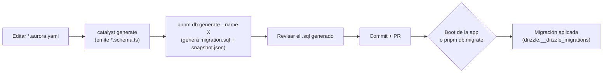

## Objetivo

Recorrer el ciclo completo para llevar un cambio de esquema desde la YAML de Aurora hasta una base de datos real, y saber qué hacer cuando el chequeo de CI (`schema-drift-check`) falla en tu PR.

## Antes de empezar

- Backend de Aurora Catalyst con drizzle-kit ya configurado (`backend/drizzle.config.ts`).
- Conoces el flujo YAML → CLI → código generado (ver [Scaffolding de un módulo](../../../concepts/backend/module-scaffolding/)).
- Acceso de escritura a la base de datos de desarrollo si vas a aplicar migraciones localmente.

## Cómo se materializa el esquema

En Aurora Catalyst el esquema de la base de datos cambia **exclusivamente** a través de migraciones versionadas. El DDL nunca se deduce ni se aplica "en caliente" comparando código contra la base de datos: cada cambio de esquema pasa por dos artefactos versionados en git, que se revisan en el PR como cualquier otro código:

- Un `migration.sql` con el DDL exacto que se va a ejecutar — legible, revisable en un PR, igual que cualquier otro cambio de código.
- Un `snapshot.json` que describe el estado del esquema después de aplicar esa migración — es la base contra la que se compara el siguiente cambio.

Si conoces Laravel, el paralelo es directo: `php artisan make:migration` + `php artisan migrate` es exactamente este mismo patrón — un artefacto explícito y un comando de aplicación separado. La diferencia de drizzle-kit es que el equivalente a `make:migration` se autogenera por diff: no escribes el DDL a mano, `drizzle-kit generate` lo calcula comparando tus `*.schema.ts` contra el último snapshot.

## El ciclo completo



1. **Editas `*.aurora.yaml`** — el campo o la tabla nueva se declara ahí, nunca directamente en TypeScript.
2. **`catalyst generate`** lee la YAML y emite (entre otros archivos) el `*.schema.ts` de drizzle bajo `infrastructure/drizzle/`. Este paso NO toca la base de datos ni genera ninguna migración — solo actualiza la definición TypeScript de la tabla.
3. **`pnpm db:generate --name <nombre-descriptivo>`** — aquí entra drizzle-kit: diffea el `*.schema.ts` recién actualizado contra el último `snapshot.json` y escribe una carpeta nueva con `migration.sql` + `snapshot.json`. Es un paso **offline**: no abre conexión a la base de datos.
4. **Revisas el `.sql`** generado antes de dar por bueno el cambio — confirma que describe solo lo esperado (los `CREATE`/`ALTER` previstos, ningún `DROP` accidental).
5. **Commit** de la carpeta de migración completa (`migration.sql` + `snapshot.json`) junto con el `*.schema.ts` que la originó.
6. **Aplicación**: en desarrollo, el siguiente arranque de la app la aplica automáticamente (`DrizzleMigrationsRunner` en el boot). En despliegue puedes usar `pnpm db:migrate` como paso explícito, sin levantar la aplicación.

## Los tres scripts `db:*`

| Script | Qué hace | Ejemplo | Salida esperada |
| --- | --- | --- | --- |
| `pnpm db:generate --name <nombre>` | Genera una migración nueva a partir del diff de `*.schema.ts`. El nombre es obligatorio — sin él, el comando falla explícitamente en vez de inventar un apodo aleatorio. | `pnpm db:generate --name add-invoice-tables` | Crea `src/database/migrations/drizzle/<timestamp>_add-invoice-tables/` con `migration.sql` y `snapshot.json`. |
| `pnpm db:migrate` | Aplica las migraciones pendientes sin arrancar Nest, reutilizando exactamente el mismo mecanismo que usa el boot. | `pnpm db:migrate` | `Applying drizzle schema migrations...` seguido de `Drizzle schema migrations up to date.` Si no hay pendientes, termina igual de rápido (no-op). |
| `pnpm db:check` | Detecta drift sin tocar la base de datos: corre un `generate` de prueba y verifica si produce una carpeta nueva. Es el comando que corre en CI. | `pnpm db:check` | `Sin drift: *.schema.ts está alineado con el snapshot.` (exit 0) o un mensaje de drift más instrucciones (exit distinto de 0). |

### Cuando falla `schema-drift-check` en tu PR

El workflow de CI `.github/workflows/schema-drift-check.yml` corre `pnpm db:check` en cada PR que toca un `*.schema.ts` o la carpeta de migraciones. Si falla, significa que editaste el esquema sin generar su migración correspondiente. La solución es siempre la misma: ejecuta `pnpm db:generate --name <descriptivo>` localmente, revisa el `.sql` resultante, y añade la carpeta generada al mismo commit/PR.

## `DATABASE_MIGRATE_ON_BOOT`: quién aplica la migración y cuándo

Por defecto (variable ausente, o `true`) cada arranque de la aplicación aplica las migraciones pendientes automáticamente. Es el comportamiento correcto para desarrollo: nadie tiene que acordarse de un paso extra.

En **producción con varias réplicas**, este mismo mecanismo es un riesgo: la aplicación de migraciones corre dentro de una única transacción, pero SIN bloqueo (*advisory lock*). Si dos réplicas arrancan a la vez, ambas pueden intentar aplicar la misma migración — la que pierde la carrera falla su arranque (no corrompe nada, pero es un fallo de despliegue evitable).

El patrón soportado para ese caso: pon `DATABASE_MIGRATE_ON_BOOT=false` y aplica el esquema como un paso explícito de despliegue, antes de levantar las réplicas:

```bash
DATABASE_MIGRATE_ON_BOOT=false pnpm db:migrate
```

### Hostings con usuario de base de datos restringido

Si tu hosting (por ejemplo, un panel estilo Plesk) te da un usuario de base de datos sin privilegio `CREATE`, vas a encontrarte con esto: `migrate()` ejecuta `CREATE SCHEMA IF NOT EXISTS` de forma incondicional, y Postgres deniega esa sentencia para un usuario sin `CREATE` **aunque el schema ya exista**. No hay ninguna variable que evite esa llamada. El patrón es el mismo que en multi-réplica: `DATABASE_MIGRATE_ON_BOOT=false` + `pnpm db:migrate` ejecutado con credenciales privilegiadas en el paso de despliegue, dejando la aplicación en runtime con el usuario restringido.

## `DATABASE_MIGRATIONS_SCHEMA` / `DATABASE_MIGRATIONS_TABLE`

Opcionales, con los mismos defaults que drizzle-orm (`drizzle` / `__drizzle_migrations`). Sirven para mover el "libro de registro" de migraciones aplicadas a otro schema o nombre de tabla — por ejemplo, si tu hosting reserva el schema `drizzle` para otra cosa.

**Gotcha importante:** no cambies estas variables en un entorno que ya tiene migraciones aplicadas. El journal nuevo aparece vacío, y `migrate()` interpretaría que ninguna migración se ha aplicado nunca — reejecutaría todas desde cero. Decide la ubicación una vez, antes del primer arranque de ese entorno, y no la toques después.

## Problemas comunes

**Edité un `migration.sql` a mano y ahora `generate` me pide decisiones raras (hints) para todo el equipo.** El `snapshot.json` que acompaña a esa migración quedó desalineado con el SQL real. La solución es regenerar esa migración conservando su nombre de carpeta EXACTO — drizzle decide qué aplicar por el nombre, no por el contenido, así que renombrar es seguro. Nunca edites `snapshot.json` a mano: son cientos de KB de JSON generado.

**Trabajo en un worktree y de repente aparecen tablas de otra rama en mi base de datos.** Los worktrees de este proyecto comparten la misma base de datos de desarrollo. Si `DATABASE_MIGRATE_ON_BOOT` está en su valor por defecto, cada arranque aplica cualquier migración presente en el disco de ese worktree — incluida una migración de una rama sin mergear. No es un bug del mecanismo, es una consecuencia del entorno compartido.

**Mi migración falla con un choque de nombre de índice que no tiene nada que ver con mi tabla.** Postgres comparte el espacio de nombres de los índices por *schema*, no por tabla. Dos migraciones que generan un índice con el mismo nombre corto (`row_id_key`, por ejemplo) chocan aunque pertenezcan a tablas distintas. Cualifica siempre el nombre del índice con la tabla (`<tabla>_<columnas>_idx`) y mantente por debajo de 63 caracteres (el límite de identificador de Postgres).

**Instalé o regeneré un módulo con el CLI y nada cambió en la base de datos.** Es esperado: el CLI reparte *definiciones* (`*.schema.ts`), nunca migraciones. Después de generar o regenerar un módulo que toca `infrastructure/drizzle/*.schema.ts`, sigue tocando ejecutar `pnpm db:generate --name <algo>` tú mismo.

## Relacionado

- [Scaffolding de un módulo](../../../concepts/backend/module-scaffolding/) — de dónde sale el `*.schema.ts` que drizzle-kit diffea.
- Referencia operativa completa (procedimiento de resync, stamp de baseline en bases de datos preexistentes): `backend/src/database/migrations/drizzle/README.md` en el repositorio de `aurora-catalyst`.
